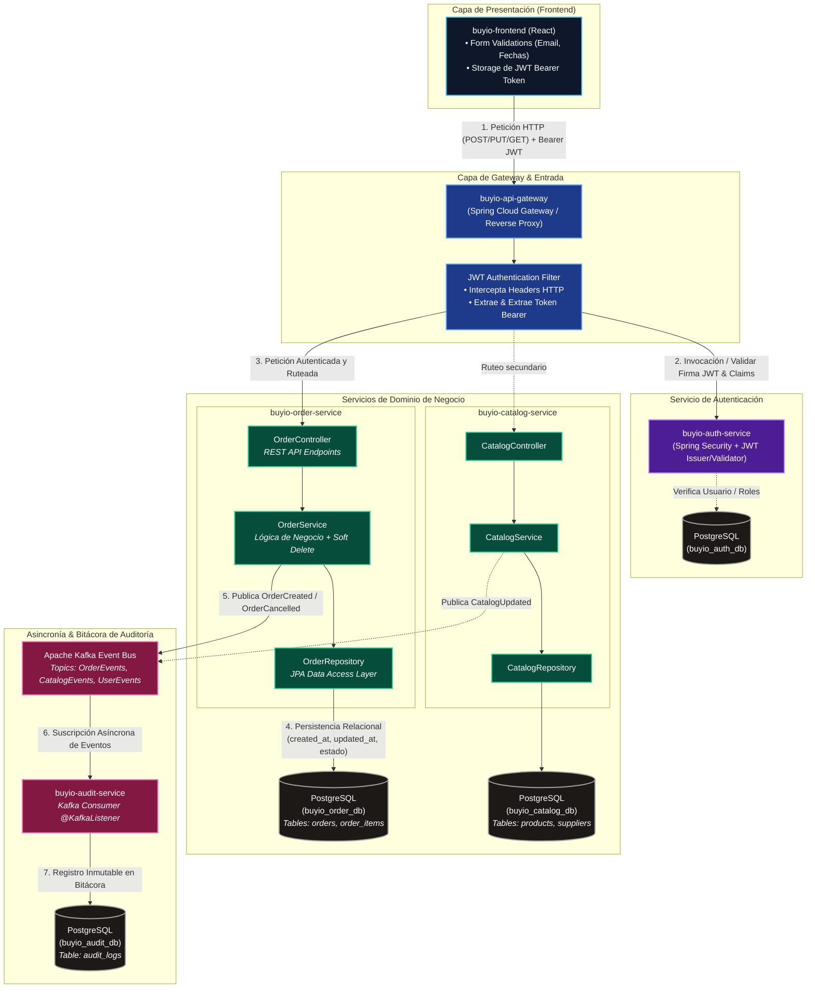

# buyio-platform




## Flujo Técnico de la Arquitectura

1. **Intercepción y Validación JWT:** Toda solicitud originada en el cliente React ingresa por `buyio-api-gateway`. El filtro customizado `JwtAuthenticationFilter` extrae el token del header `Authorization: Bearer <token>` e interactúa con `buyio-auth-service` para verificar su firma, vigencia y autoridades antes de dar paso a los servicios internos. Si el token es inválido o no está presente, se retorna de forma inmediata una respuesta `401 Unauthorized`.

2. **Procesamiento de Órdenes de Compra:** Una vez autorizada la solicitud, el Gateway la enruta hacia `OrderController` dentro de `buyio-order-service`. La capa de servicio (`OrderService`) ejecuta la lógica transaccional, aplicando anulación lógica (*soft delete*) cambiando el campo de estado de la orden en lugar de realizar una eliminación física (`DELETE`).

3. **Persistencia Relacional y Auditoría de Fechas:** Las entidades JPA gestionadas mediante `OrderRepository` mapean las relaciones clave con productos/proveedores y ejecutan el guardado en la base de datos PostgreSQL correspondiente (`buyio_order_db`). Cada tabla garantiza la bitácora obligatoria mediante las anotaciones de auditoría JPA (`@CreatedDate` / `@LastModifiedDate`) asignando automáticamente `created_at` y `updated_at`.

4. **Trazabilidad Asíncrona vía Kafka:** Tras confirmar la transacción relacional, el servicio emite un evento de dominio (`OrderEvents`) hacia Apache Kafka. El microservicio `buyio-audit-service` consume estos mensajes de forma descolada y asíncrona, registrando el historial unificado y no mutable de cambios en `buyio_audit_db`.


## Modelo de Datos (Entidad-Relación)

```mermaid
erDiagram
    %% Microservicio: buyio-auth-service
    USERS {
        BIGINT id PK
        VARCHAR username UK
        VARCHAR email UK
        VARCHAR password
        VARCHAR role
        TIMESTAMP created_at "BITÁCORA"
        TIMESTAMP updated_at "BITÁCORA"
    }

    %% Microservicio: buyio-catalog-service
    SUPPLIERS {
        BIGINT id PK
        VARCHAR name
        VARCHAR email
        VARCHAR phone
        VARCHAR status "ESTADO (ACTIVE/INACTIVE)"
        TIMESTAMP created_at "BITÁCORA"
        TIMESTAMP updated_at "BITÁCORA"
    }

    CATEGORIES {
        BIGINT id PK
        VARCHAR name UK
        VARCHAR description
        TIMESTAMP created_at "BITÁCORA"
        TIMESTAMP updated_at "BITÁCORA"
    }

    PRODUCTS {
        BIGINT id PK
        VARCHAR code UK
        VARCHAR name
        TEXT description
        NUMERIC price
        BIGINT supplier_id FK
        BIGINT category_id FK
        VARCHAR status "ESTADO (ACTIVE/INACTIVE)"
        TIMESTAMP created_at "BITÁCORA"
        TIMESTAMP updated_at "BITÁCORA"
    }

    %% Microservicio: buyio-order-service
    ORDERS {
        BIGINT id PK
        VARCHAR order_number UK
        BIGINT supplier_id "FK Logica -> SUPPLIERS"
        NUMERIC total_amount
        VARCHAR status "ESTADO (CREATED/CANCELLED/COMPLETED)"
        TIMESTAMP created_at "BITÁCORA"
        TIMESTAMP updated_at "BITÁCORA"
    }

    ORDER_ITEMS {
        BIGINT id PK
        BIGINT order_id FK
        BIGINT product_id "FK Logica -> PRODUCTS"
        INTEGER quantity
        NUMERIC unit_price
        NUMERIC subtotal
        TIMESTAMP created_at "BITÁCORA"
        TIMESTAMP updated_at "BITÁCORA"
    }

    %% Microservicio: buyio-audit-service
    AUDIT_LOGS {
        BIGINT id PK
        VARCHAR entity_name
        VARCHAR entity_id
        VARCHAR action
        VARCHAR performed_by
        TEXT payload
        TIMESTAMP created_at "BITÁCORA"
    }

    %% Relaciones Fisica dentro de buyio-catalog-service
    SUPPLIERS ||--o{ PRODUCTS : "provee"
    CATEGORIES ||--o{ PRODUCTS : "clasifica"

    %% Relacion Fisica dentro de buyio-order-service (1 a Muchos)
    ORDERS ||--|{ ORDER_ITEMS : "contiene"

    %% Relaciones Logicas entre dominios
    SUPPLIERS ..o{ ORDERS : "referencia_logica (supplier_id)"
    PRODUCTS ..o{ ORDER_ITEMS : "referencia_logica (product_id)"
```
